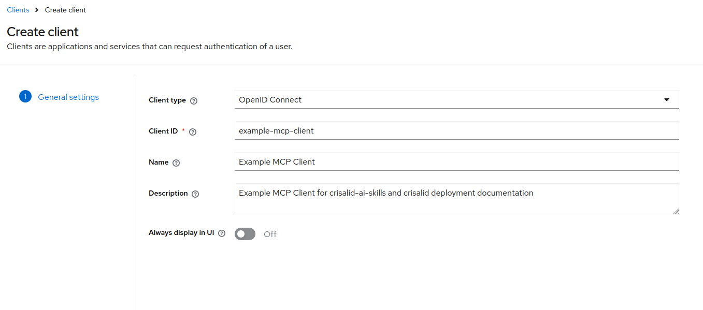
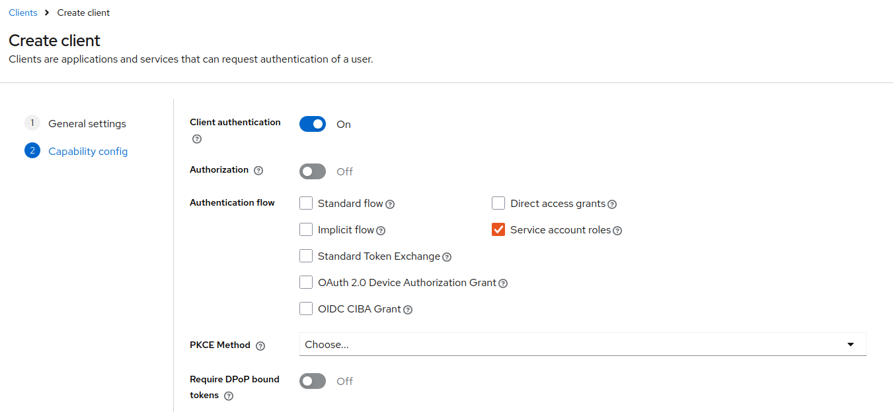
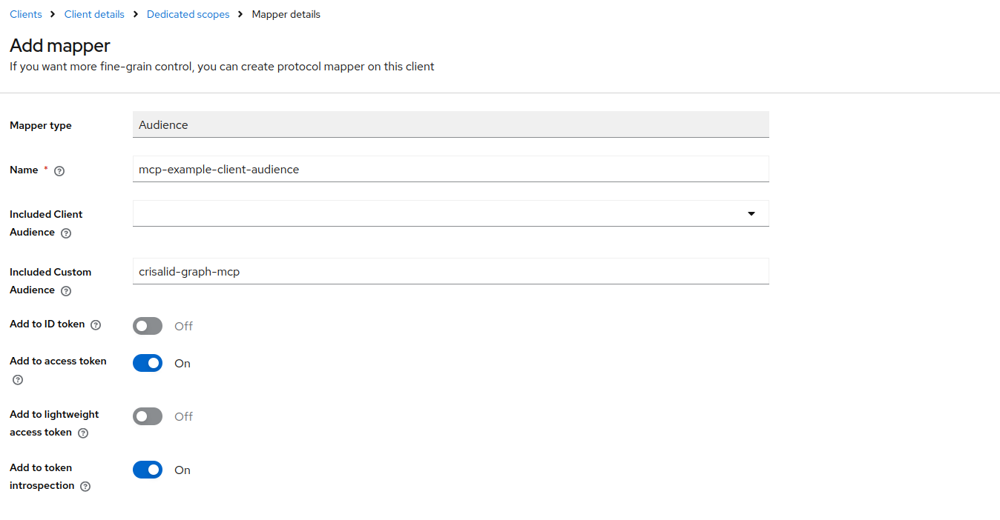

The **Neo4j MCP Toolbox** exposes curated Cypher queries as [MCP](https://modelcontextprotocol.io/) tools, making it easy to integrate structured CRISalid knowledge graph data into LLM-based agents and workflows.

Two toolsets are available:

| Toolset | Tools |
|---|---|
| `crisalid-restricted` | `get-crisalid-schema`, `list-person-publications` |
| `crisalid-unrestricted` | above + `execute-cypher-readonly` |

All tools in the restricted toolset require a valid JWT — clients must authenticate via a Keycloak service account.

---

### 1. Expose the Toolbox Port on the Host

By default, the `neo4j-mcp` service only exposes port `5000` **inside** the Docker network. Other containers (e.g. an LLM agent running in the same stack) can reach it at `http://neo4j-mcp:5000` without any extra configuration.

To access the toolbox from the **host machine** (e.g. during development or from an external client), uncomment the `ports:` section in `docker/neo4j-mcp/neo4j-mcp.yaml`:

```yaml
# ports:
#   - "5000:5000"
```

Then restart the service:

```bash
docker compose \
  -f docker-compose.yaml \
  -f docker-compose.prod.yaml \
  --profile neo4j-mcp \
  up -d --no-deps --force-recreate neo4j-mcp
```

The toolbox will then be reachable at `http://localhost:5000` on the host.

---

### 2. Create a Keycloak Service Account

::: {.callout-important}
Each client application that calls the MCP toolbox needs its own dedicated Keycloak service account. The steps below create one example account — repeat them for every client.
:::

#### Step 1 — Create the client

In Keycloak admin → **Clients** → **Create client**.

Set **Client type** to `OpenID Connect` and choose a **Client ID** (e.g. `example-mcp-client`):

{fig-alt="Keycloak Create client – General settings"}

#### Step 2 — Configure capabilities

On the next screen (**Capability config**):

- Enable **Client authentication**
- Check **Service account roles** only — uncheck Standard flow and Direct access grants

{fig-alt="Keycloak Create client – Capability config"}

#### Step 3 — Add an Audience mapper

The toolbox validates the JWT `aud` claim against the fixed value `crisalid-graph-mcp`. By default Keycloak does not include this in the token — you must add a mapper.

Navigate to: **Clients** → your client → **Client scopes** → click the dedicated scope (`<client-id>-dedicated`) → **Add mapper** → **Configure a new mapper** → **Audience**.

Fill in the mapper as shown:

- **Name**: `mcp-example-client-audience`
- **Included Custom Audience**: `crisalid-graph-mcp`
- **Add to access token**: On

{fig-alt="Keycloak Add mapper – Audience"}

#### Step 4 — Note the client secret

Go to **Clients** → your client → **Credentials** and copy the secret. You will pass it as `KEYCLOAK_CLIENT_SECRET` in your client environment.

---

### 3. Example Client (Python)

Install the dependency:

```bash
pip install toolbox-langchain
# or with uv:
uv add toolbox-langchain
```

The following example connects to the toolbox, authenticates against Keycloak using the `client_credentials` grant, and loads the restricted toolset:

```python
import asyncio
import os

import httpx
from toolbox_core.protocol import Protocol
from toolbox_langchain import ToolboxClient

TOOLBOX_URL = "http://localhost:5000"  # adjust if running inside the Docker network
KEYCLOAK_ISSUER = os.environ["KEYCLOAK_ISSUER"]        # e.g. https://keycloak.example.org/realms/crisalid-inst
KEYCLOAK_CLIENT_ID = os.environ["KEYCLOAK_CLIENT_ID"]  # e.g. example-mcp-client
KEYCLOAK_CLIENT_SECRET = os.environ["KEYCLOAK_CLIENT_SECRET"]


def get_token() -> str:
    response = httpx.post(
        f"{KEYCLOAK_ISSUER}/protocol/openid-connect/token",
        data={
            "grant_type": "client_credentials",
            "client_id": KEYCLOAK_CLIENT_ID,
            "client_secret": KEYCLOAK_CLIENT_SECRET,
        },
    )
    response.raise_for_status()
    return response.json()["access_token"]


async def main():
    async with ToolboxClient(TOOLBOX_URL, protocol=Protocol.MCP_LATEST) as toolbox:
        tools = await toolbox.aload_toolset(
            "crisalid-restricted",
            auth_token_getters={"crisalid-keycloak": get_token},
        )
        print(f"Loaded {len(tools)} tool(s): {[t.name for t in tools]}")

        schema_tool = next(t for t in tools if t.name == "get-crisalid-schema")
        result = await schema_tool.ainvoke({})
        print(result)


asyncio.run(main())
```

::: {.callout-note}
`Protocol.MCP_LATEST` is required — toolbox v1.1.0 and above enforce the MCP protocol version on the client handshake.
:::

The toolset name passed to `aload_toolset()` must match one of the toolsets served by the toolbox (`crisalid-restricted` or `crisalid-unrestricted`). The auth token getter key (`crisalid-keycloak`) must match the auth service name configured in the toolbox.
